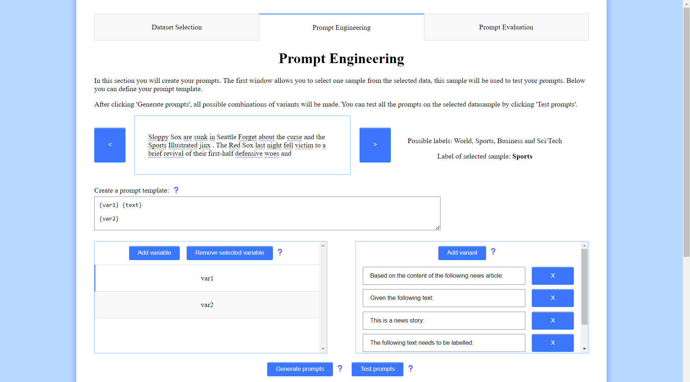

## Getting Started

### Setup locally

Make sure you are using Python version 3.11+.

```
git clone https://github.com/Luuk-Versteeg/MMA-group3
cd MMA-group3
python -m venv .venv
source .venv/bin/activate
pip install -r requirements.txt
```

### Run

On the root directory of the project run:

```
export PYTHONPATH="$PYTHONPATH:$PWD"
python src/main.py
```

After the Dash server is running open http://127.0.0.1:8050/ on your browser.

### Setup on Snellius

To run the dashboard using Snellius you first have to create a link between port 8050 on Snellius and your local port.

```
ssh -L 8050:127.0.0.1:8050 scurXXXX@snellius.surf.nl
```

Request a gpu node, in this case for 15 minutes:

```
salloc --partition=gpu --gpus=1 --ntasks=1 --cpus-per-task=18 --time=00:15:00
```

Go back to the login node and create a link between the gpu node and the login node:

```
ssh intX
ssh -N -f -L 8050:127.0.0.1:8050 gcnXX
ssh gcnXX
```

Now you can load the modules to get access to the lastest Python version and be able to run Pytorch:

```
module load 2022
module load Anaconda3/2022.05
```

Follow the steps at "Setup Locally" and "Run" to start the dashboard.

### Screenshots

#### Data Selection


#### Prompt Engineering




#### Prompt Evaluation


